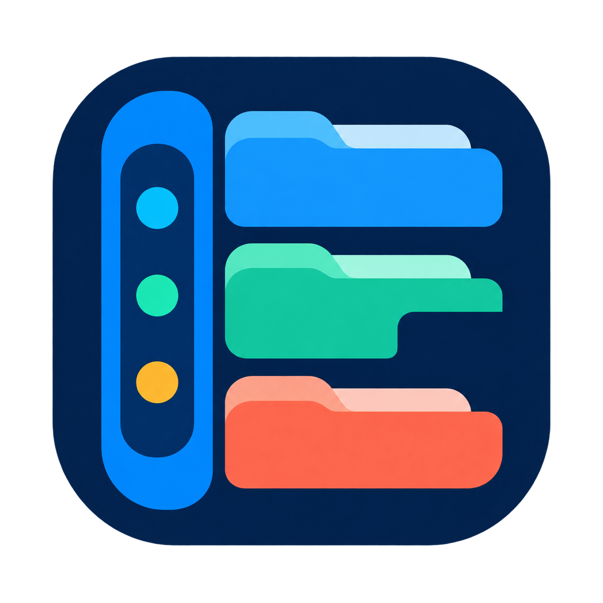
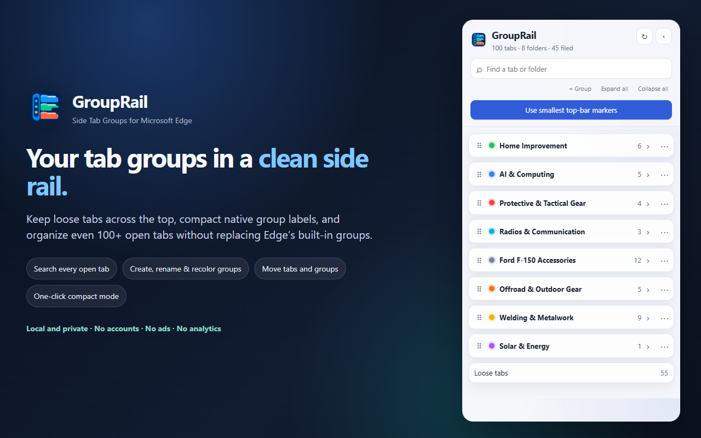

<p align="center">
  
</p>

# GroupRail — Side Tab Groups & Tab Manager for Microsoft Edge

**A privacy-first, collapsible tab-group sidebar that leaves your ordinary tabs across the top.**

GroupRail is a free, open-source Edge extension for people with dozens—or hundreds—of open tabs. It turns native Edge tab groups into a compact folder rail in the browser side panel, while ungrouped tabs remain in Edge's familiar horizontal tab strip and keep their order.

GroupRail 1.0.3 is under development and has been dogfood-tested in Microsoft Edge with a real 100+ tab window plus a privacy-safe 100-tab test profile.



## Why GroupRail?

Edge makes you choose between a crowded horizontal strip and moving every tab into vertical tabs. GroupRail is for the middle ground:

- Keep ungrouped, frequently used tabs visible across the top.
- Navigate named tab groups from a collapsible side panel.
- Collapse every folder with one click when you want a quiet rail.
- Search open tabs by title, site, or group name.
- Preserve native Edge tab groups instead of inventing a separate bookmark system.
- Reduce inactive group labels in the top strip to Edge's smallest supported colored markers.
- Create, rename, recolor, reorder, or safely ungroup native groups.
- Drag groups into a new order and drag tabs within or between groups, including Loose Tabs.
- Use the compact organizer menus as an accessible alternative to dragging.
- In smallest-marker mode, right-click a browser tab to move it with **GroupRail: Move this tab**; the extra tab-strip menu hides itself when Edge's native group names are visible. The webpage organizer remains available in either mode.
- Optionally assign your own **Toggle compact group names** shortcut; GroupRail deliberately reserves no default key combination.

This makes GroupRail relevant to searches such as **tab groups sidebar**, **Edge tab manager**, **vertical tab groups**, **collapse tab groups**, and **organize many tabs** while keeping a distinct, memorable product name.

## What it does

- Lists native Edge tab groups as expandable folders in the side panel.
- Shows favicons, full tab titles, site names, group colors, tab counts, and active-tab state.
- Provides explicit **Expand all** and **Collapse all** controls plus a chevron on every folder.
- Shows immediate spinner, checkmark, and tab-count feedback when manually refreshed.
- Keeps loose tabs in their existing top-strip order and hides their long list until requested.
- Activates a selected tab without reading or changing the webpage.
- Adds a compact `⋯` organizer to each group and tab.
- Adds restrained grab handles for direct group and tab drag-and-drop; the same operations remain available from menus.
- Offers Edge's nine native group colors as an accessible visual swatch picker.
- Keeps every tab open when a group is removed; **Ungroup** never closes tabs.
- Saves native group names locally before compacting the top strip.
- Restores saved group names with one click.
- Follows system light/dark mode and uses restrained translucent surfaces with high-contrast text.

## How compact mode works

1. Open GroupRail from its toolbar button or press `Ctrl+Shift+.`.
2. Select **Use smallest top-bar markers**.
3. GroupRail stores the current native group names locally, replaces their top-strip labels with an invisible compact placeholder, and collapses inactive groups.
4. The full group names remain available in the side panel.
5. Select **Show names in Edge menus** at any time to reverse the change.

Compact mode and Edge's built-in tab-strip group menu share one browser limitation: Edge uses the same title for both places. Smallest-marker mode therefore makes the names blank in Edge's native **Add tab to group** menu. GroupRail preserves the full names in its rail and adds **GroupRail: Move this tab** to the tab-strip menu while compact mode is active. That extra tab-strip entry hides itself when native names are restored; the webpage organizer remains available in either mode. If you prefer Edge's native tab-strip menu, choose **Show names in Edge menus**.

To assign the optional toggle hotkey, open Edge's **Keyboard shortcuts** page for extensions, find GroupRail, and choose a key combination for **Toggle compact group names**. No shortcut is assigned by default, so GroupRail cannot conflict with an existing key binding unless you choose one.

Use the `‹` control in GroupRail's header to collapse the rail completely and return all page width. Reopen it from the pinned GroupRail toolbar icon or the keyboard shortcut. Edge owns the dock width; drag the panel divider to make GroupRail as narrow as you prefer.

The extension runs locally and uses Edge's supported `sidePanel`, `tabs`, and `tabGroups` APIs. Its background worker is event-driven; it does not poll while the panel is closed. Favicons are served through Edge's browser-local extension favicon resource; GroupRail rejects direct remote favicon URLs.

## Important Edge limitation

Edge does not let extensions remove open tabs or native group markers from the browser's top strip, add a second native tab row, make the side panel float transparently over a webpage, or choose the side-panel width. GroupRail therefore uses the closest supported design:

- the webpage remains beside Edge's docked, user-resizable side panel;
- inactive groups can be reduced to Edge's smallest colored native markers (Edge does not allow removing the markers entirely);
- full group names and controls live in the collapsible rail;
- active grouped tabs may remain visible because Edge controls its own tab-strip behavior.
- tab groups cannot be nested inside a parent group; Edge supports one group level only.

## Privacy and permissions

GroupRail has no accounts, ads, analytics, telemetry, content scripts, host permissions, or application-controlled network requests. It does not load remote favicon URLs.

| Permission | Why it is needed |
| --- | --- |
| `tabs` | Display tab titles, URLs, favicons, order, and active state; activate the tab you choose. |
| `tabGroups` | Display and, only when requested, create, rename, recolor, move, compact, restore, or ungroup native groups. |
| `contextMenus` | Add the local **GroupRail: Move this tab** menu inside webpages and, only while compact mode hides native names, to the tab strip. |
| `favicon` | Ask Edge's browser-local favicon resource for cached site icons without loading a site's remote favicon URL directly. |
| `sidePanel` | Show GroupRail in Edge's supported side panel. |
| `storage` | Save group names, display preferences, and privacy-minimized active-group match keys locally. Match keys exclude credentials, query strings, fragments, invalid URLs, and local file paths; unmatched records receive a 24-hour recovery window before pruning. |

GroupRail cannot read cookies, saved passwords, form data, or page contents. See [PRIVACY.md](PRIVACY.md) for the full policy.

## Install locally for testing

1. Download the latest `GroupRail-v*.zip` from [GitHub Releases](https://github.com/Fowlplaychiken/EdgeLeftsideGroupTabs/releases), then extract it. Alternatively, clone this repository.
2. Open `edge://extensions`.
3. Turn on **Developer mode**.
4. Choose **Load unpacked**.
5. Select the extracted release folder or this repository folder.
6. Pin GroupRail if desired, then select its toolbar icon to open the side panel.

Loading an unpacked extension grants the permissions listed above. Review the source and permission explanation before installing it in a browser profile that contains personal tabs.

## Test evidence

- Unit/model suite: 11 passing tests.
- Isolated Edge fixture: 100 tabs, 8 groups, 45 grouped tabs, and 55 loose tabs.
- Measured panel reload/render for that fixture: about 50 ms on the development machine.
- Privacy-safe real-workload shape used for sizing: 97 tabs, 8 named groups, 48 loose tabs, 57 sites, median title length 55 characters, and maximum title length 137 characters.
- Compact/restore round trip preserved group names in the isolated profile and the everyday Edge profile.
- Security regression coverage rejects direct remote favicon URLs, strips sensitive URL components from local match keys, and prunes records for retired groups.
- Organizer round trips covered create, rename, all nine colors, menu and drag-based group order, menu and drag-based tab order, cross-group tab moves, and ungroup-without-close; the 100-tab count remained unchanged.
- Dragging a group changed Edge's real group indexes, and dragging a tab across groups changed both membership and exact top-bar position; the original fixture order was then restored exactly.
- Editing while compact retained the invisible native marker, updated the saved rail name, and restored the edited native name exactly.
- Search, long-title truncation, folder toggles, light mode, and dark mode were visually inspected.
- Edge's actual side-panel target was opened beside a normal Microsoft Learn webpage; an individual `›`, **Expand all**, **Collapse all**, and full rail close were exercised there.
- Compact mode was verified to set all eight native group titles to the invisible placeholder and restore all eight original names exactly.
- The everyday-profile dogfood pass confirmed the compact markers and side rail with 97 tabs and 8 real groups.

These are development results, not a promise of identical performance on every computer.

## Development

GroupRail is plain Manifest V3 JavaScript, HTML, and CSS. It has no build step and no third-party runtime dependencies.

Run the tests with a recent Node.js version:

```powershell
npm test
```

Before a release, also load the unpacked extension in Edge and complete the manual checks in [STORE_LISTING.md](STORE_LISTING.md).

## Project principles

- Keep the extension single-purpose and fast.
- Prefer reversible changes to native Edge groups.
- Request only essential permissions.
- Keep all tab metadata on the user's device.
- Never claim browser-chrome behavior that has not been visually verified.

## Security

GroupRail's threat-focused source audit covers all tracked files and the packaged extension. See [SECURITY.md](SECURITY.md) for the reporting path and design guarantees. The v1.0.1 hardening release removed direct remote favicon loading and minimized locally stored URL match keys. Version 1.0.2 preserves folder names when Edge recreates native group IDs or briefly exposes an incomplete session-restore snapshot, while still pruning unmatched records after a 24-hour recovery window. Version 1.0.3 adds the named GroupRail organizer directly to Edge's tab-strip right-click menu without requesting another permission.

## License

MIT. GroupRail is free software and is not affiliated with or endorsed by Microsoft.
